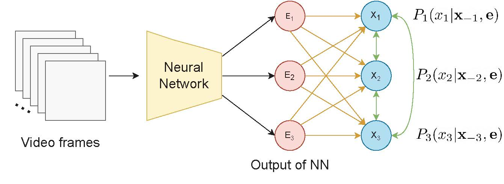
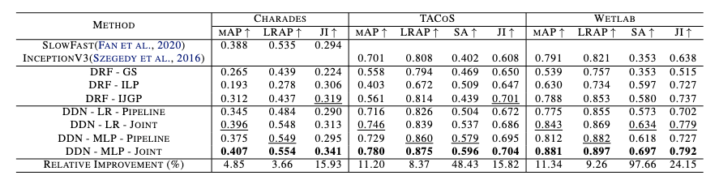
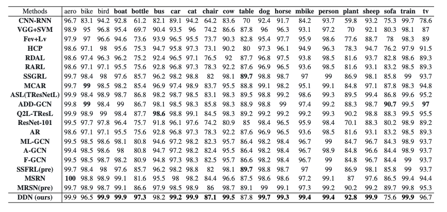

# Deep Dependency Networks

# Introduction
This is the official implementation of Deep Dependency Networks (DDN). DDNs augments a dependency network to the output of a neural network. 

# Abstract
We propose a simple approach which combines the strengths of probabilistic graphical models and deep learning architectures for solving the multi-label classification task in images and videos.  First, we show that the performance of previous approaches that combine Markov Random Fields with neural networks can be modestly improved by leveraging more powerful methods such as iterative join graph propagation, integer linear programming, and L1 regularization-based structure learning. Then we propose a new modeling framework \textit{called deep dependency network}, which augments a dependency network, a model that is easy to train and learns more accurate dependencies but is limited to Gibbs sampling for inference to the output layer of a neural network. We show that despite its simplicity, jointly learning this new architecture yields significant improvements in performance over the baseline neural network. In particular, our experimental evaluation on three video activity classification datasets: Charades, Textually Annotated Cooking Scenes (TACoS), and Wetlab, and three multi-label image classification datasets: PASCAL VOC, MS-COCO, and NUS-WIDE show that deep dependency networks are almost always superior to pure neural architectures that do not use dependency networks.

[//]: # (![]&#40;&#41;)
[//]: # (*Illustration of Dependency Network &#40;for Action Classification&#41; for three actions &#40;labels&#41;. Video clips are given as input to the NN and it produces the features &#40;$E_1,E_2,E_3$&#41; for the DN &#40;red colored nodes&#41;. These features are then used to model the conditional distributions at each variable $X_i$ &#40;blue colored nodes&#41;. At each node $X_i$, the form of the conditional distribution is the variable given its parents &#40;incoming arrows - represented by orange and green colored arrows&#41; in the graph.*)

|  |
|:--:| 
| *Illustration of Dependency Network (for Action Classification) for three actions (labels). Video clips are given as input to the NN and it produces the features ($E_1,E_2,E_3$) for the DN (red colored nodes). These features are then used to model the conditional distributions at each variable $X_i$ (blue colored nodes). At each node $X_i$, the form of the conditional distribution is the variable given its parents (incoming arrows - represented by orange and green colored arrows) in the graph.* |

# Results
## Results for multi-label action classification task
|  |
|:--:| 
| *Comparison of our methods with the baseline for MLAC task. The best/second best values are bold/underlined. The last row shows the relative improvement made by the best performing proposed method over the baseline* |

## Results for multi-label image classification task
|  |
|:--:| 
| *Comparison of our methods with the baseline for MLIC task. The best/second best values are bold/underlined. The last row shows the relative improvement made by the best-performing proposed method over the baseline.* |

## AP metric for multi-label image classification task on PASCAL VOC
| 
|:--:| 
| *Comparison of AP (in %) of our method and state-of-the-art methods on Pascal VOC2007 dataset. Numbers in bold indicate the best performance.* |

## Annotation Comparison
|  |
|:--:| 
| *Annotations comparison of Q2L and DDN-MLP on MS-COCO dataset. Labels in bold represent the difference between the two methods assuming that the threshold of 0.3 is used (i.e., every label whose probability is greater than 0.3 is considered a predicted label). We also provide the probabilities in (). Labels in [] represent labels that were not classified by the corresponding method (Added to compare the probabilities). The first three column shows examples where DDN improves over CNN, while the last column (outlined in red) shows an example where DDN is worse than CNN. Best viewed in colors.* |

# Quick Start
1. Clone this repo.
2. Use to requirements file ([charades](MLAC/requirements/joint_ddn_charades.yml), [wetlab and TaCOS](MLAC/requirements/joint_ddn_tacos_wetlab.yml), [coco](MLIC/requirements/ddn_coco.yml), [NUS-WIDE and PASCAL VOC](MLIC/requirements/ddn_nus_voc.yml)) given in the corresponding directories to install the packages (please use conda for this). We also provide the requirements files to install the dependencies for all the baselines in their corresponding folders.
3. Download the datasets and the pre-trained models. More details about the baselines are given in MODEL_ZOO.md files ([MLAC](MLAC/MODEL_ZOO.md) and [MLIC](MLIC/MODEL_ZOO.md) ). 
4. Train and Test DDN. More details are given in GETTING_STARTED.md files in both directories. 
