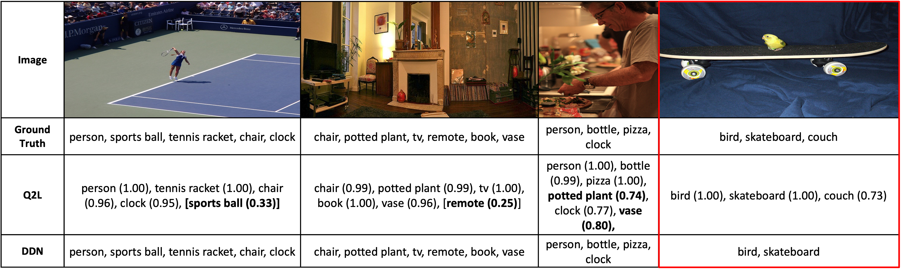

# Deep Dependency Networks and Advanced MPE Inference Schemes

# Introduction

Welcome to the official implementation of "Deep Dependency Networks and Advanced Inference Schemes for Multi-Label Classification." In this repository, we present the key details of our research work on enhancing multi-label classification using Deep Dependency Networks (DDNs) and advanced inference techniques.

# Abstract

We present a unified framework called deep dependency networks (DDNs) that combines dependency networks and deep learning architectures for multi-label classification, with a particular emphasis on image and video data. The primary advantage of dependency networks is their ease of training, in contrast to other probabilistic graphical models like Markov networks. In particular, when combined with deep learning architectures, they provide an intuitive, easy-to-use loss function for multi-label classification. A drawback of DDNs compared to Markov networks is their lack of advanced inference schemes, necessitating the use of Gibbs sampling. To address this challenge, we propose novel inference schemes based on local search and integer linear programming for computing the most likely assignment to the labels given observations. We evaluate our novel methods on three video datasets (Charades, TACoS, Wetlab) and three multi-label image datasets (MS-COCO, PASCAL VOC, NUS-WIDE), comparing their performance with (a) basic neural architectures and (b) neural architectures combined with Markov networks equipped with advanced inference and learning techniques. Our results demonstrate the superiority of our new DDN methods over the two competing approaches.

|

|                                                                                                                                                                                                                                      |
| :----------------------------------------------------------------------------------------------------------------------------------------------------------------------------------------------------------------------------------------------------------------: |
| *Illustration of improvements made by our proposed inference scheme for DDNs. The DDN learns label relationships and the inference scheme excels in leveraging these relationships to accurately identify concealed objects, such as the **sports ball**.* |

|                                                                                                                                                                                                                                                                                                                                                                                                                                                                                                                      |
| :------------------------------------------------------------------------------------------------------------------------------------------------------------------------------------------------------------------------------------------------------------------------------------------------------------------------------------------------------------------------------------------------------------------------------------------------------------------------------------------------------------------------------------------------------------------------: |
| *Illustration of Dependency Network (for Action Classification) for three actions (labels). Video clips are given as input to the NN and it produces the features ($e_1,e_2,e_3$) for the DN (red colored nodes). These features are then used by the sigmoid output ($\sigma_1$, $\ldots$, $\sigma_n$) of the dependency layer to model the local conditional distributions. At each node $X_i$, the form of the conditional distribution is the variable given its parents (incoming arrows - represented by orange and green colored arrows) in the graph.* |

# Annotation Comparison

|                                                                                                                                                                                                                                                                                                                                                                                                                                                                                                                                                  |
| :------------------------------------------------------------------------------------------------------------------------------------------------------------------------------------------------------------------------------------------------------------------------------------------------------------------------------------------------------------------------------------------------------------------------------------------------------------------------------------------------------------------------------------------------------------------------------: |
| *Comparison of labels predicted by Q2L and our DDN-ILP scheme on the MS-COCO dataset. Labels in bold represent the difference between the predictions of the two methods, assuming that a threshold of 0.5 is used (i.e., every label whose probability $ > 0.5$ is considered a predicted label). Due to the MPE focus in DDN-ILP, only label configurations are generated, omitting corresponding probabilities. The first three column shows examples where DDN improves over Q2L, while the last column (outlined in red) shows an example where DDN is worse than Q2L.* |

# Quick Start

1. Clone this repo.
2. Use to requirements file ([charades](MLAC/requirements/joint_ddn_charades.yml), [wetlab and TaCOS](Methods/MLAC/requirements/joint_ddn_tacos_wetlab.yml), [coco](Methods/MLIC/requirements/ddn_coco.yml), [NUS-WIDE and PASCAL VOC](Methods/MLIC/requirements/ddn_nus_voc.yml)) given in the corresponding directories to install the packages (please use conda for this). We also provide the requirements files to install the dependencies for all the baselines in their corresponding folders.
3. Download the datasets and the pre-trained models. More details about the baselines are given in MODEL_ZOO.md files ([MLAC](MLAC/MODEL_ZOO.md) and [MLIC](MLIC/MODEL_ZOO.md) ).
4. Use the requirement file for the [Advanced Inference Schemes](Methods/Inference_Schemes/DDN-Advanced-Inference-main/environment.yml)
5. Train and perform Inferences DDN. More details are given in GETTING_STARTED.md files in the directories.

The following things are supported for this project -

1. Train the DDNs jointly for all the datasets.
2. Perform the following inference strategies
   1. Gibbs Sampling
   2. Local Search Based Methods
   3. Multi-Linear Integer Programming

[//]: #
